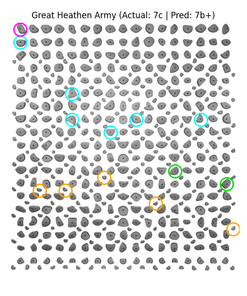
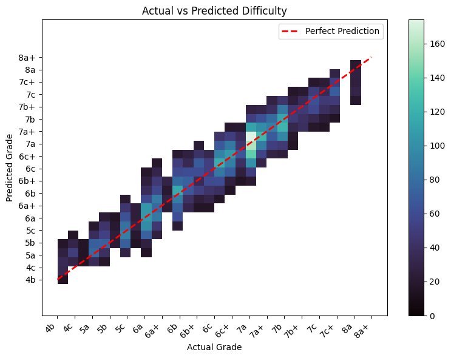
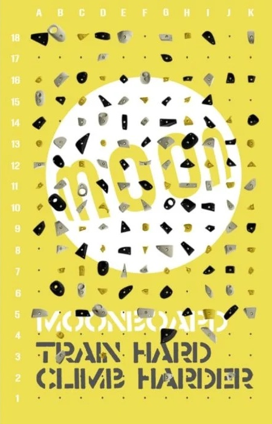
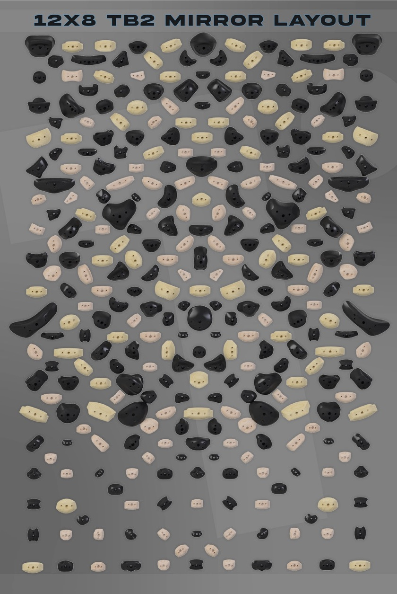
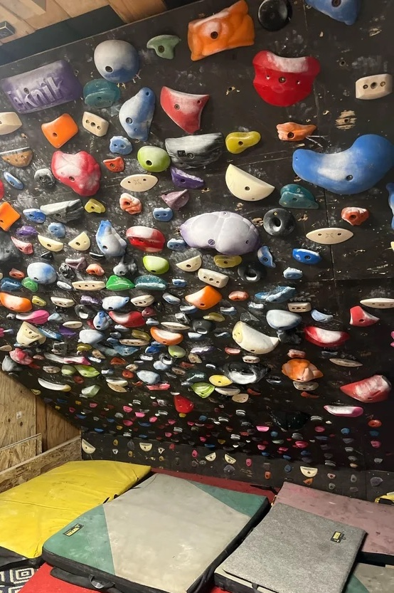
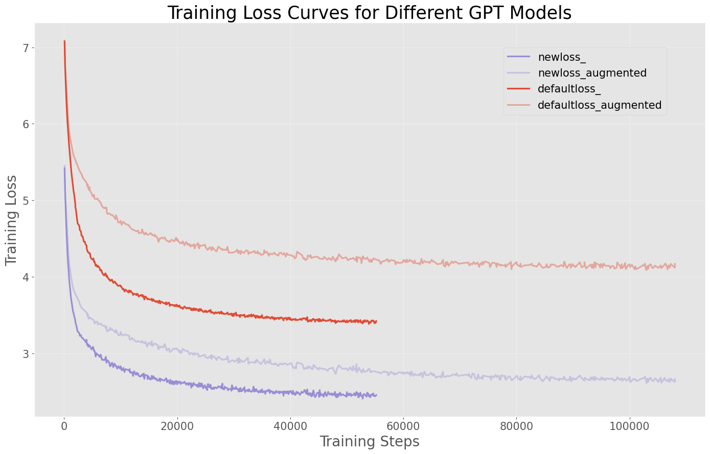
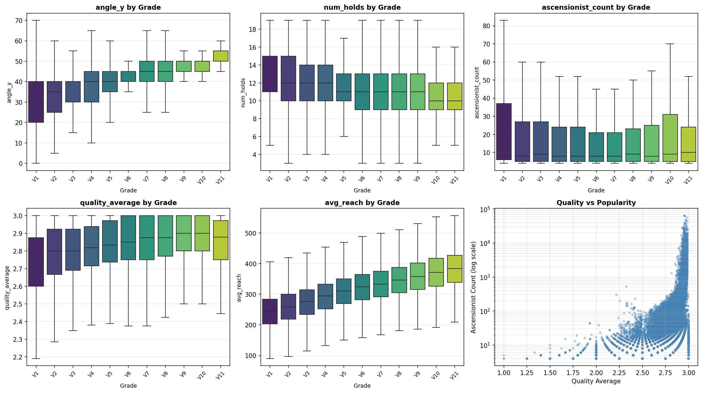
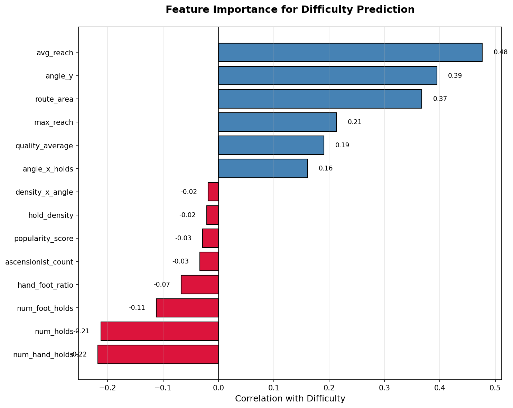
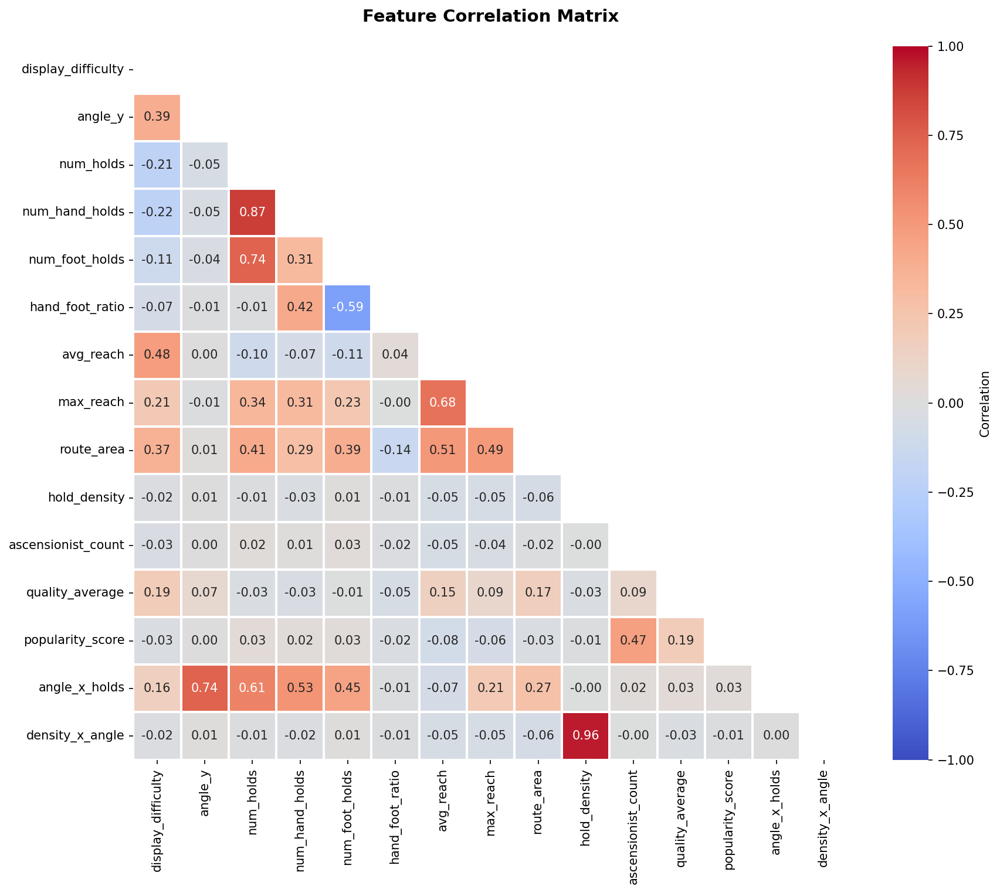

# KilterTransformer

GPT-Architecture Decoder transformers for climbing route generations on the Kilter Board.

## Overview

All data are fetched from boardlib library. Standardized boards are chosen because of their ease of hold encoding, without image processing burden. Though, that could be another interesting idea. Kilter Board is chosen for its popularity and availability of data. Solution could work with moonboard or tensionboard with minor tweaks since no spatial encoding is done.

Have a look at the model playground: [Huggingface/spaces/kilter-transformer](https://huggingface.co/spaces/nottreepat/test2)


<div align="center">
  
</div>

**Dataset:** ~70,000 cleaned boulders from the `boardlib` library.

**Custom GPT Implementation:**
- Lightweight `GPT2LM` architecture with Linear Modeling head  (~7M parameters) built using PyTorch and HuggingFace
- Custom tokenizer and vocabulary dict (~2000 tokens)
- Trained with custom order-invariant loss and data augmentation, specific to climbing domain
- Host model and datasets on huggingface's spaces, interface built with Gradio
   

**Custom BERT Implementation:**
- 4 layers, 8 attention heads (~1M parameters) built using PyTorch and HuggingFace's `BertConfig`
- 2D positional embeddings for spatial awareness
- Metadata integration (angle, density, reach)

**Performance:**
<p align="center">
  <table>
    <tr><th>Model</th><th>RMSE</th><th>±1 V-grade Accuracy</th></tr>
    <tr><td>XGBoost</td><td>1.9</td><td>76%</td></tr>
    <tr><td><b>BERT Encoder</b></td><td><b>1.6</b></td><td><b>82%</b></td></tr>
  </table>
</p>


<div align="center">
    
</div>

*"That last 6%, it doesn't sound like a lot, but it's tremendous"* - Gale Boetticher, Breaking Bad (probably)

*"82% will do just fine"* - Gus Fring (probably)

## Installation
```bash
# Clone repository
git clone https://github.com/nnott3/KilterTransformer.git
cd KilterTransformer

# Install dependencies, make sure that torch>2.6.0
uv sync

jupyter notebook notebooks/EDA.ipynb
# run first block to read sqlite3 
# explore all the functionalities
jupyter notebook notebooks/bert.ipynb
jupyter notebook notebooks/gpt_new.ipynb
```

TODO
- [x] Add similarity search
- [ ] Make Clustering/Generation based on style+grade (powerful, crimpy, shouldery, technical)
- [x] Route Generation
- [ ] Tidy up temp_gpt.py
- [ ] Add technical blog
 

## Project Structure
```
project-root/
├── src/
│   ├── data_processing.py      
│   ├── evaluation.py           
│   ├── features_eng.py         
│   ├── visualizations.py       # for all plots
│   ├── bert_ass.py             # BERT with tokenizer and model from scratch
│   └── temp_gpt.py             # KilterGPT class and tokenizer modules
├── data/
│   ├── climbs_cleaned.csv      # Raw data
├── notebooks/
│   ├── EDA.ipynb               # data processing, simple modeling
│   ├── bert.ipynb              # BERT for difficulty prediction
│   ├── bert_improved.ipynb     # BERT but more structured
│   ├── gpt_new.ipynb (*)       # Training notebook for final GPT
│   └── gpt_shuffle_me.ipynb    # dratf GPT 
├── saved_models/               # Checkpoints for predictions models
├── models/                     # Checkpoints for GPT models
├── hugginface/
│   ├── app.py                  
│   ├── create_model_config.py
│   ├── create_model_config.py
│   ├── upload_model_to_hf.py
│   ├── deploy_to_hf.sh         # syncing this repo with huggingface/spaces repo
│   └── fonts/
├── figs/                    
```

## Technical Yap

The first couple of issues i encountered was how to encode the boulders into code representation. I have tried the following. Remember, the main goal is to generate new climbs robustly.

<p float="left">
  <span style="padding-right:10px;">
    
  </span>
  <span style="padding-right:10px;">
    
  </span>
  <span>
    
  </span>
</p>


- one-hot encoding: 1/0 for the whole vocab size of each hold. works great in regression (difficulty prediction). but i have no idea building for generation.
- featured engineering: derived stats like `avg_reach`, `std_reach`, `avg_angle`, `hand_feet_ratio`, `hand_pos`, and so on. Also works great in regression (kinda surprising that XGBoost can predict grade without even know the individual holds). Still, idk how to do generation.
  - actually, i tried Markov chain-ish autoregressive generation. E.g, sampling start/finish holds where they should be according to the grades. with that, find holds within avg_reach (according to the grade), etc. Didn't really work out great. seems like i tried too hard.
- Go for GPT to deal with generation and solve everything else accordingly.

### Tokenization
I decided to include grade and angle as (system)prompt for each climb in addition to all the holds. We have 
- range(20, 50, 5) for angle
- range(12, 29) for grade that is ~4c/v0 to ~8a+/v12
- every combination of `hold_id` and roles{`start`, `hand`, `feet`, `finish`} 
In total we have 1932 unique tokens including the special ones (`BOS`, `EOS`, `PAD`)

<div align="center">
  
</div>

For example, the boulder above can be tokenized as:
`angle40_grade_18 _feet1169_feet1183_feet1198_ start1234_start1236 _hand1268_hand1284_hand1316_hand1353_ finish1387` (spaced for clarity)

### Order-Invariant Loss Function

Here's the problem: **different token orders can represent the same physical route**.

```python
# These represent the SAME boulder:
[BOS, angle, grade, hold_A, hold_B, hold_C, hold_D, EOS]
[BOS, angle, grade, hold_A, hold_C, hold_B, hold_D, EOS]
```

Standard cross-entropy loss treats these as completely different sequences and penalizes the model for "wrong" predictions—even when predicting valid holds. 

My purposed solution to this is:

Instead of asking *"what's the next token?"*, we ask *"what are ALL the remaining valid tokens?"*

At each position `t`, we define a **valid set** of acceptable next tokens:
```
𝒮_t = {all remaining holds that haven't been predicted yet}
```

The model learns to put high probability on **any token in this set(remaining holds in the boulder)**:
```python
P(𝒮_t | previous_holds) = P(hold_A) + P(hold_B) + P(hold_C)
```

#### Implementation Concept

**Cross-Entropy loss** (single target):
```python
# Extract probability of THE correct token
target_prob = log_probs[position, correct_token]
loss = -target_prob
```

**Set loss** (multiple valid targets):
```python
# 1. Get log probabilities for all tokens
log_probs = log_softmax(logits)  # (B, L, V)

# 2. Mask out invalid tokens (already used, EOS)
valid_mask = create_future_tokens_mask(labels)  # (B, L, V)
masked_log_probs = where(valid_mask, log_probs, -1e9)

# 3. Sum probabilities of ALL valid tokens
log_sum = logsumexp(masked_log_probs, dim=-1)  # log(P(A) + P(B) + P(C))
loss = -log_sum.mean()
```


### Data Augmentation

Every pass, we shuffle the token sequence from a random position. For example.
- `hold A_hold B_hold C_hold D_ hold E`
- shuffle .................^
- `hold A_hold B_hold E_hold D_ hold C`

This will further amplify the goal that we want the model to perform:
        
1. **Bidirectional Generation**: Generate from middle → start + end, not just left-to-right
2. **Order Invariance**: Learn that different orders = same route

Initially, with similar epochs, the training should take N times longer (N is the number of pass/augmentation). However, with N=2, we realize that stopping at 1/2 epoch length yields the model with similar test loss.

<div align="center">
  
</div>

### Dataset Stats

<div align="center">
  
  
  
</div>