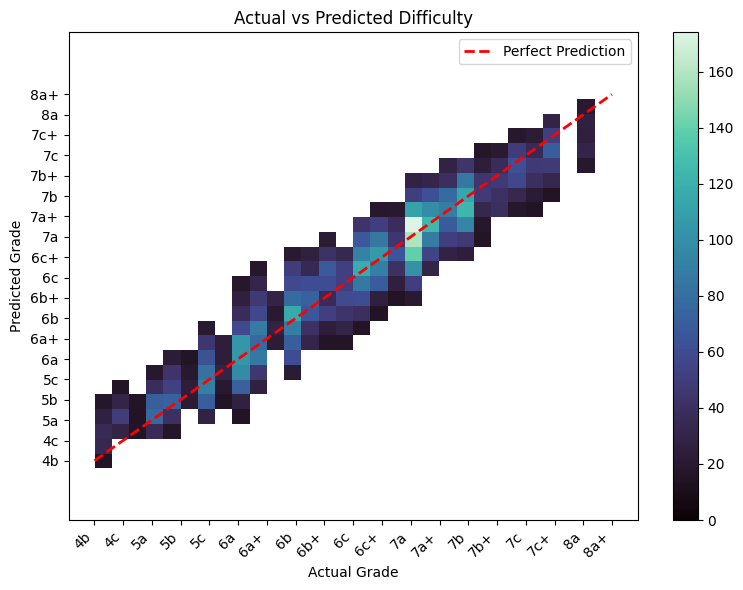

# KilterTransformer

BERT-based transformers for climbing route difficulty prediction on Kilter Board.

## Overview

All data are fetched from boardlib library. Kilter board is chosen from its standardization and popularity. Encoding is done with ease, without image processing burden. Though, that could be another interesting idea.

<div align="center">
  
  
</div>


**Dataset:** ~65k boulders after cleaning

**Custom BERT Implementation:**
- 4 layers, 8 attention heads (~1M parameters) built using PyTorch and HuggingFace's BertConfig
- Custom tokenizer and vocabulary dict (~1000 tokens)
    - Hold encoding: `hold_id, hand_or_foot` (binary: foot vs hand/start/finish)
- 2D positional embeddings for spatial awareness
- Metadata integration (angle, density, reach)

**Performance:**
- Baseline XGBoost: RMSE 1.9 (76% ±1 V-grade accuracy)
- BERT Encoder: RMSE 1.6 (82% ±1 V-grade accuracy)

<div align="center">
    
</div>

*"That last 6%, it doesn't sound like a lot, but it's tremendous"* - Gale Boetticher, Breaking Bad (probably)

*"82% will do just fine"* - Gus Fring (probably


## Project Structure
├── utils/
│ ├── data_processing.py
│ ├── evaluation.py
│ ├── features_eng.py
│ ├── visualizations.py # for all plots
│ └── transformer_good_ass.py # BERT with tokenizer and model from scratch
├── src/
│ ├── cleaned_routes.csv # Raw data
│ └── route_features.csv # Engineered features
├── saved_models/ # Model checkpoints
└── main.ipynb # execution of major class functions

## Installation
```bash
# Clone repository
git clone https://github.com/nnott3/KilterTransformer.git
cd KilterTransformer

# Install dependencies
pip install -r req

# in main.ipynb, run first block to read sqlite3 
# explore all the functionalities
```

TODO
- [ ] Add similarity search
- [ ] Make Clustering that works based on style+grade
- [ ] Route Generation
 